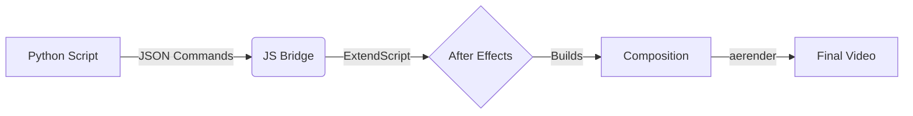

# After Effects Automation

[](https://badge.fury.io/py/after-effects-automation)
[](https://opensource.org/licenses/MIT)
[](https://www.python.org/downloads/)
[](https://pepy.tech/project/after-effects-automation)


A unified video automation platform for Adobe After Effects. Define compositions in JSON, drive them from Python or the command line, and render at scale.

**PyPI Package:** [pypi.org/project/after-effects-automation](https://pypi.org/project/after-effects-automation/)

---

## Why This Tool?

Most After Effects scripting workflows involve running individual scripts from a menu, managing files by hand, and manually triggering renders. After Effects Automation takes a different approach: you describe what you want in a JSON configuration, and the platform handles everything else — launching AE, building compositions, updating properties, and rendering the final video — in a single automated pipeline.

The entire workflow is **configuration-driven**. A JSON config file defines your project structure, timeline, scenes, and custom actions. Python reads that config and orchestrates every step through a JavaScript bridge into After Effects. No manual AE interaction required.

You get **three ways to work**: a Python API for full programmatic control, a CLI for running configs and managing projects from the terminal, and a built-in Web Editor for visually editing configurations without touching JSON directly.

Under the hood, the platform provides **intelligent process management** — automatic AE launching, window readiness detection, crash dialog handling, and responsiveness verification — so your automation runs reliably from start to finish without babysitting.

---

## Table of Contents
- [Quick Start](#quick-start)
- [Capabilities](#capabilities)
- [Documentation](#documentation)
- [Examples](#examples)
- [How It Works](#how-it-works)
- [Compatibility](#compatibility)
- [CLI & Web Editor](#cli-tools)
- [Troubleshooting](#troubleshooting)

---

## Quick Start

```bash
# 1. Install from PyPI
pip install after-effects-automation

# 2. Setup After Effects integration
python install_ae_runner.py

# 3. Run an example
cd examples/basic_composition
python run.py

```

**That's it!** A 10-second video will be created automatically.

**PyPI:** [pypi.org/project/after-effects-automation](https://pypi.org/project/after-effects-automation/)
**Need more help?** See the [Quick Start Guide](QUICK_START.md)

---

## Capabilities

### Python API

Full programmatic control over the automation pipeline:

```python
from ae_automation import Client

client = Client()
client.startBot("config.json")
```

- Build AE templates programmatically
- Update text layers with dynamic content
- Assemble complex timelines from template compositions
- Access all After Effects features via ExtendScript
- Render final video output

### CLI

Run automation, launch the editor, and diagnose issues from the terminal:

```bash
# Run automation from a config file
ae-automation run config.json

# Launch the visual config editor
ae-automation editor config.json

# Test your setup
ae-automation test --verbose

# Run diagnostics
ae-automation diagnose
```

### Web Editor

A built-in browser-based interface for editing JSON configurations visually — no manual JSON editing required:

```bash
ae-automation editor config.json
```

---

## Documentation

| Guide | Description |
| --- | --- |
| [Installation](INSTALLATION.md) | Full setup: Python package, CLI, AE bridge, and environment configuration |
| [Quick Start](QUICK_START.md) | End-to-end walkthrough from install to rendered video |
| [Examples](examples/README.md) | Complete automation pipeline examples with config and output |
| [CLI Guide](CLI_GUIDE.md) | Command-line interface reference for all `ae-automation` subcommands |
| [Troubleshooting](TROUBLESHOOTING.md) | Common issues, diagnostics, and platform-specific fixes |
| [Process Management](PROCESS_MANAGEMENT.md) | How the platform manages the After Effects process lifecycle |

---

## Examples

### Basic Composition

Create a video with intro and outro in ~2 minutes:

```bash
cd examples/basic_composition
python run.py

```

### Text Animation

Multi-layer text with dynamic content:

```bash
cd examples/text_animation
python run.py

```

### Render Only

Quickly render existing .aep files:

```bash
cd examples/render_only
python render.py

```

**More Examples:** See [examples/README.md](examples/README.md)

> [!TIP]
> Starring this repo helps more developers discover after-effects-automation
>
>
>
>  Also check out my other project [RepoGif](https://github.com/jhd3197/RepoGif) – the tool I used to generate the GIF above!

---

## Compatibility

| Software | Versions |
| --- | --- |
| **After Effects** | 2024, 2025, 2026 (CC versions should work) |
| **Python** | 3.7+ |
| **OS** | Windows, macOS, Linux (experimental) |

---

## How It Works

Your Python code (or a JSON config) describes the desired video. The platform translates that into ExtendScript commands, sends them to After Effects through a file-based command queue, and renders the final output — all without manual intervention.



1. **Python** defines what you want to create
2. **JavaScript bridge** sends commands to After Effects via a file-based queue
3. **After Effects** builds the composition
4. **aerender** renders the final video

**Technical Details:** See [Process Management Guide](PROCESS_MANAGEMENT.md)

---

## CLI Tools

### Automation

Run automation from a config file using the command line:

```bash
ae-automation config.json

```

### Web Editor (Visual Interface)

Prefer a GUI? Launch the visual editor to modify your configs without touching JSON.

```bash
ae-editor config.json

```

---

## Troubleshooting

### Common Issues

**After Effects won't start?**

* Check `.env` has correct AE path
* Verify AE version matches path (2024 vs 2025)

**Scripts not executing?**

* Enable scripting: `Edit > Preferences > Scripting & Expressions`
* Install startup script: `python install_ae_runner.py`

**Empty/black video?**

* Update to latest version: `pip install --upgrade after-effects-automation`
* This was a bug in the batch system (now fixed)

**More Solutions:** See [Troubleshooting Guide](TROUBLESHOOTING.md)

---

## Contributing

Contributions welcome! Here's how:

1. **Report bugs** - [GitHub Issues](https://github.com/jhd3197/after-effects-automation/issues)
2. **Share examples** - Add to `examples/` folder
3. **Improve docs** - All `.md` files in repo
4. **Submit PRs** - Bug fixes and features

---
## License

This project is licensed under the **MIT License**.
See the [LICENSE](LICENSE) file for full details.

**Adobe After Effects** is a trademark of Adobe Inc. This project is **not affiliated with, endorsed by, or sponsored by Adobe Inc.**

---

### Disclaimer

This project is an **automation and middleware tool** for Adobe After Effects.
It requires a **valid Adobe Creative Cloud license** to use.

The tool works by translating Python commands into **Adobe-supported ExtendScript (JavaScript)** instructions that After Effects already supports natively.

* It does **not** modify, crack, patch, or bypass Adobe software
* It does **not** distribute Adobe assets or binaries
* It does **not** enable use of After Effects without a license

We do **not** support or condone software piracy in any form.

By using this project, you confirm that you have obtained Adobe After Effects through official channels at [https://www.adobe.com/products/aftereffects.html](https://www.adobe.com/products/aftereffects.html).

---

## Get Help

* **PyPI Package** - [pypi.org/project/after-effects-automation](https://pypi.org/project/after-effects-automation/)
* **Documentation** - Guides in the repository root (see [Documentation](#documentation) table above)
* **Examples** - Working code in `examples/` folder
* **Issues** - [GitHub Issues](https://github.com/jhd3197/after-effects-automation/issues)
* **Discussions** - [GitHub Discussions](https://github.com/jhd3197/after-effects-automation/discussions)

---

**Made with care by the After Effects Automation community**
